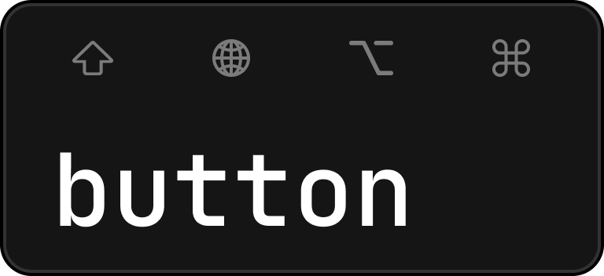
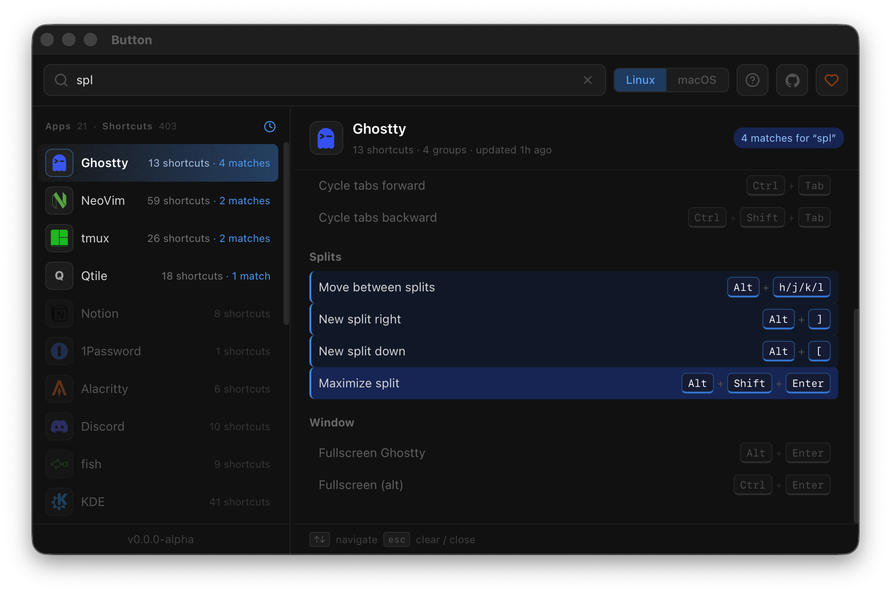

<p align="center">
  
</p>

<p align="center">
A cross-platform (Linux, macOS, and Windows) quick-reference GUI for personal keyboard shortcuts.
</p>

<p align="center">
  
</p>

---

## Installation

### Linux

Download the latest `linux-amd64.tar.gz` from the [Releases](https://github.com/stankovictab/button/releases) page.\
Extract the binary and run the executable.

> **Note:** AUR support is planned for the future.

### macOS

Download the latest `macos-arm64.zip` from the [Releases](https://github.com/stankovictab/button/releases) page.\
After extracting `Button.app`, run `xattr -cr ~/Downloads/Button.app`,\
or allow it in **System Settings** so macOS removes the quarantine flag.

> **Note:** Button is still not signed, so macOS will not allow it to run unless you disable Gatekeeper.

### Windows

Download the latest `windows-amd64.zip` from the [Releases](https://github.com/stankovictab/button/releases) page.\
Extract the archive and run `button.exe`.

## Config

App shortcuts are defined as YAML files in the config directory:
- **Linux / macOS:** `~/.config/button/apps/`
- **Windows:** `%LOCALAPPDATA%\button\apps\`

See [this example](examples/template.yaml) for an app configuration.

### YAML fields

| Field | Description |
| --- | --- |
| `app` | Display name shown in the app list. **Required.** |
| `icon` | Lowercase icon key used to look up the app icon in `frontend/src/lib/icons/iconMap.ts`. |
| `groups` | Array of shortcut groups. Each group contains a `category` and `shortcuts`. |
| `category` | Group name shown in the app detail panel. |
| `shortcuts` | Array of shortcut entries inside a group. |
| `desc` | Shortcut description shown next to the key binds. |
| `keys` | Default binds for the shortcut. A single bind: `[Ctrl, K]`. <br>Multiple alternatives (array of arrays): `[[Ctrl, K], [Ctrl, Shift, K]]` <br>or in block style (each alternative on its own `- [...]` line). |
| `linux` | Linux/Windows-specific binds that override `keys` on Linux and Windows. <br>Accepts the same single or multi-alternative format as `keys`. |
| `macos` | macOS-specific binds that override `keys` on macOS. <br>Accepts the same single or multi-alternative format as `keys`. |

---

## CI/CD

- PRs targeting `main` run validation only: <br>bindings generation, frontend checks/build, `go build ./...`, and a Linux `wails build` smoke test.
- Releases are created manually from `main` with the GitHub Actions `Release` workflow.
- The release version comes from `wails.json` `info.productVersion`.
- Re-running the release workflow for the same version replaces the existing GitHub Release/tag <br>and publishes fresh artifacts from the current `main` commit.

### Release Flow

1. Open a PR and iterate until the branch works locally.
2. Merge to `main`.
3. Update `wails.json` `info.productVersion` on `main` whenever you want the next shipped version to change.
4. Run the `Release` workflow from `main`.
5. Download the generated Linux/macOS/Windows artifacts from the resulting GitHub Release.

---

## Development

### Prerequisites

- [Go](https://go.dev/) 1.21+
- [Wails v2](https://wails.io/docs/gettingstarted/installation) (`go install github.com/wailsapp/wails/v2/cmd/wails@latest`)
- [Node.js](https://nodejs.org/) (for the frontend)

### Build Types

There are three distinct build targets in this project, each serving a different purpose:

#### 1. Go only — `go build ./...`

Compiles the Go source code only. Does **not** produce a runnable application — the frontend is not included. Useful for quickly checking that Go code compiles without errors (e.g. after editing backend logic).

```bash
go build ./...
```

#### 2. Frontend only — `npm run build`

Compiles the Svelte/TypeScript frontend via Vite into `frontend/dist/`. Does **not** produce a runnable application — the Go binary is not included. Useful for checking frontend compilation errors in isolation.

```bash
wails generate module
cd frontend
npm install
npm run build
```

> **Note:** On a fresh clone, run `wails generate module` first so `frontend/wailsjs/` exists before frontend-only checks/builds.

#### 3. Full app — `wails build`

Compiles everything into a single self-contained binary: builds the frontend, embeds it into the Go binary, and outputs the result to `build/bin/`. This is the distributable artifact.

```bash
wails build
# Output: build/bin/button (Linux), build/bin/button.app (macOS), or build/bin/button.exe (Windows)
```

### Running

Run the app in dev mode with hot-reload:

```bash
wails dev
```

This starts:
- A Vite watcher for the frontend (changes to `.svelte`/`.ts`/`.css` files reflect immediately via HMR)
- A Go recompiler (changes to `.go` files trigger an automatic rebuild and restart)

> **Note:** The config directory `~/.config/button/apps/` is created automatically on first launch. Drop `.yaml` or `.yml` files there to populate the app. Changes are picked up live without needing a restart.
